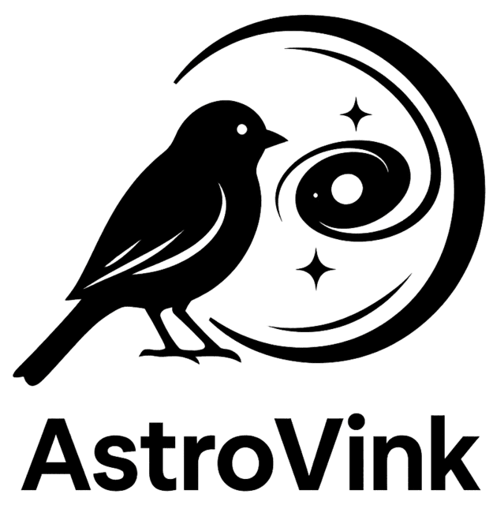

# AstroVink
<p align="center">
  
</p>

**Version:** AstroVink-Q1  

AstroVink is a Vision Transformer (ViT-S/14, DINOv2 backbone) model fine-tuned for automated strong gravitational lens detection on Euclid Space Telescope images.  

The model architecture and training setup are described in the paper  
**“Euclid Quick Data Release (Q1): AstroVink: A vision transformer approach to find strong gravitational lens systems.”**  
(*Vincken, S. H. et al., in prep., Astronomy & Astrophysics*).

## Installation

Use the package manager [pip](https://pip.pypa.io/en/stable/) to install AstroVink.

```bash
pip install -e .
```

## Repository structure

astro_vink/ – model, inference, transforms, metrics, training and utilities  
examples/ – example scripts (no data included)  
weights/ – optional folder for local model checkpoints  


## Usage
After installation, you can run inference on an image using a fine-tuned model checkpoint.

#### Inference example
A ready to run example script is provided at 
`examples/run_inference.py`

Which can be executed directly from the project root:

```bash
python examples/run_inference.py
```
This script demonstrates how to:
- Load the model and weights
- Run inference on an image
- Print the lens and non-lens probabilities

#### Training examples
Example scripts are also provided for training and fine-tuning:

`examples/run_training.py` trains the AstroVink (base) model from scratch.

`examples/run_retraining.py` fine-tunes the model on new data.

These can be executed directly from the project root:

```bash
python examples/run_training.py
```
```bash
python examples/run_retraining.py
```

**Note:** This repository does **not** include any model weights or images. To run the example, you must provide your own image file and specify the path to the weights.

## Data availability

The data AstroVink-Q1 is applied to is available on [Zenodo](https://zenodo.org/records/15025832) as the **Euclid Quick Data Release (Q1): The Strong Lensing Discovery Engine (SLDE).**

## Citation

If you use AstroVink-Q1 or any part of this repository in academic work, please cite:

Vincken, S. H. (2025).  
*Euclid Quick Data Release (Q1): AstroVink – A vision transformer approach to find strong gravitational lens systems.*  
*Astronomy & Astrophysics* (in preparation).

A complete citation record is available in the `CITATION.cff` file.

## License

This project is released under the **MIT** License.  
See the `LICENSE` file for the full license text.  
The license applies only to the code in this repository.  
All Euclid data remain proprietary and are not included under this license.

## Contact

For questions or collaborations related to AstroVink, please contact:

**Saamie Helena Vincken**

Email: saamievincken@protonmail.com

FHNW University of Applied Sciences and Arts Northwestern Switzerland  
Email: saamie.vincken@fhnw.ch  

GitHub: [@saamievincken](https://github.com/saamievincken)

